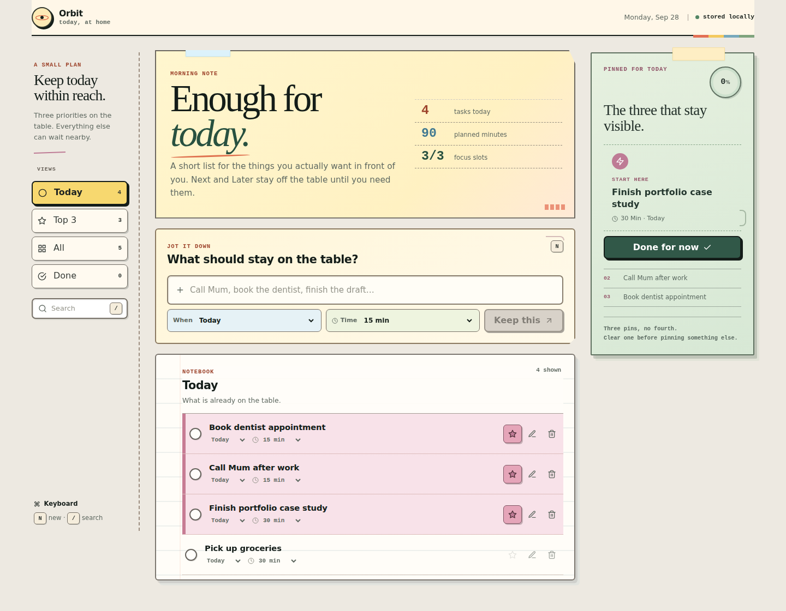

# Orbit — Daily Focus

**A small React planner built around one hard rule: no more than three focus tasks today.**

[**Open Orbit →**](https://orbit-daily-focus.vercel.app/) · [Architecture](./ARCHITECTURE.md)



```text
capture → Today → Top 3 → finish → repeat
```

Orbit is intentionally much smaller than DayDock. It is the simpler predecessor: a focused example of reducer rules, storage migration and a compact mobile task workflow.

## What it does

- Today / Next / Later planning;
- hard Top-3 cap;
- 5 / 15 / 30 / 60 minute effort estimates;
- Today, Top 3, All and Done views;
- search and inline editing;
- complete/reopen;
- delete + Undo;
- progress/effort totals;
- `N` capture and `/` search shortcuts;
- bottom navigation on mobile.

## Top 3 is enforced in the model

A fourth task cannot enter the focus set until one of the current three leaves it.

That rule lives in the reducer, not in button-disable logic, so every caller gets the same invariant.

## Storage

Current data is stored in a versioned envelope and the loader understands the original `todos` format.

On startup Orbit normalizes tasks, migrates older data, drops malformed records and can continue session-only if browser storage is unavailable.

Losing persistence does not make the task interface unusable.

## Structure

```text
React UI
   ↓
task reducer + selectors
   ↓
storage adapter
```

Search/progress/view subsets are derived rather than stored as parallel state.

## Stack

- React 18
- Vite 5
- JavaScript
- Sass / CSS Modules
- Web Storage
- Playwright
- axe-core
- Lighthouse CI
- ESLint / GitHub Actions

## Quality

```bash
npm ci
npm run check
```

Checks cover reducer behaviour, Top-3 invariant, migration/corrupt data, blocked storage, search/progress, browser journeys, mobile overflow, accessibility and Lighthouse budgets.

## Run locally

```bash
npm ci
npm run dev
```

## History

This repository began as a basic Todo learning exercise. I kept it public as part of the progression of my React work; the current version stays deliberately narrow instead of trying to become another full productivity suite.
